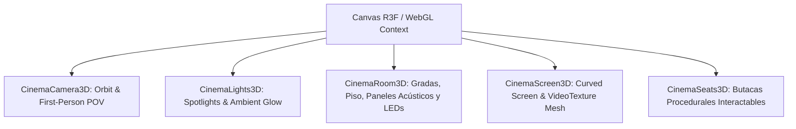
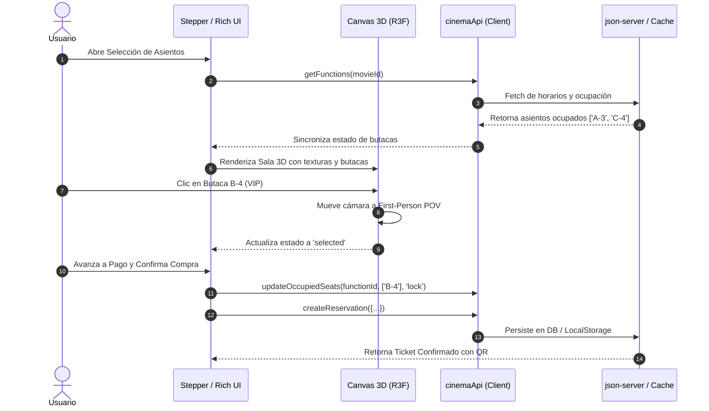

# Documento de Diseño de Software & Sistema de Diseño (Design.md)

## Proyecto: React Cinema App (CineStream / Multiplex 3D)
**Estándar de Interfaz**: **Rich UI (Experiencia de Usuario Enriquecida & Cinemática)**  
**Tecnologías UI**: React 19, Tailwind CSS v4, Framer Motion 13, Three.js / React Three Fiber, Lucide Icons

---

## 1. Fundamentos de Rich UI (Filosofía de Diseño)

Para ofrecer una **Rich UI (Interfaz Enriquecida / Wow Factor)**, la aplicación abandona la interacción web estática tradicional y adopta un modelo de **inmersión cinemática**:
1. **Atmósfera Dark Cinema & Profundidad:** Paleta oscura calibrada (`#09090b` / `neutral-950`) con fondos translúcidos, desenfoque de fondo (*glassmorphism* `backdrop-blur-md / xl`), bordes luminosos sutiles y gradientes dorados/carmesí.
2. **Interactividad Espacial 3D (WebGL en Tiempo Real):** Sala de proyección tridimensional con iluminación dinámica, pantalla curva con trailer en video, gradas procedurales y control de cámara dual (modo órbita libre panorámica y modo primera persona desde la butaca elegida).
3. **Micro-interacciones y Feedback Sensorial:** Efectos *press* elásticos en butacas 2D, transiciones de rutas con `AnimatePresence`, barras de progreso fluidas, resplandores (*glow*) reactivos, tooltips informativos con temporizadores vivos y modales de confirmación con física realista.
4. **Resiliencia & Estado Vivo:** Temporizador regresivo de 10 minutos para retención de asientos, protector de ruta interactivo (`useBlocker` con modal custom) y tolerancia completa a fallos offline (*offline-first caching*).

---

## 2. Sistema de Diseño Visual (Design System Tokens)

### 2.1 Paleta Cromática y Tokens Semánticos

| Token / Rol | Valor Hex / Tailwind | Propósito & Aplicación en UI |
|---|---|---|
| **Background Base** | `#09090b` (`neutral-950`) | Lienzo de fondo que simula la oscuridad de una sala de cine. |
| **Surface Elevada** | `neutral-900/80` con border `neutral-800` | Tarjetas, contenedores del checkout, Navbar flotante. |
| **Primary Accent (Dorado)** | `#eab308` (`amber-500` / `yellow-500`) | Asientos VIP, resplandor de la pantalla, acciones primarias y temporizadores. |
| **Secondary Accent (Carmesí)** | `#ef4444` (`red-500`) | Butacas estándar, distintivos de películas destacadas y cancelaciones. |
| **Success / Selection** | `#10b981` (`emerald-500`) | Butacas seleccionadas por el usuario, confirmación de pago y tickets validados. |
| **Occupied / Muted** | `#262626` (`neutral-800`) | Asientos ocupados/bloqueados por otros usuarios, bordes secundarios. |
| **Glow & Lights** | `rgba(234, 179, 8, 0.4)` / `rgba(167, 139, 250, 0.3)` | Resplandor proyectado por la pantalla de cine en 2D y reflectores 3D. |

### 2.2 Tipografía y Jerarquía Visual

- **Fuente Primaria:** Inter / System UI Sans-serif con renderizado optimizado (`-webkit-font-smoothing: antialiased`).
- **Encabezados Display:** `text-3xl` a `text-5xl font-black tracking-tight` con efectos de texto en gradiente (`bg-gradient-to-r from-neutral-100 to-neutral-400 bg-clip-text text-transparent`).
- **Etiquetas y Metadatos:** `text-xs font-semibold uppercase tracking-wider text-neutral-400` para badges de salas, formatos (IMAX, 3D) y clasificación por edades (B15, C).
- **Indicadores Numéricos:** Números tabulares monospaciados para temporizadores de reserva y precios (`font-mono tracking-widest`).

---

## 3. Catálogo de Componentes Rich UI (Component Inventory)

### 3.1 Sala 3D Inmersiva (React Three Fiber)
Ubicación: `src/features/seatSelection/components/cinema3d/`

- **`CinemaScreen3D`:** Malla curvada con shader/material que proyecta el tráiler en video real de la película (`HTMLVideoElement` mapeado a `VideoTexture`) con luz puntual que sincroniza el resplandor con la sala.
- **`CinemaCamera3D`:** Transición suave de cámara interpolada (`lerp`). Si el usuario selecciona una butaca, la cámara vuela al punto de vista exacto de los ojos del espectador sentado mirando hacia la pantalla.
- **`CinemaSeats3D`:** Instancias interactivas de butacas que responden a eventos de puntero (`onPointerOver`, `onClick`), cambiando de material según su estado (Estándar, VIP, Seleccionado, Ocupado).
- **Control de Fallback de Hardware:** Detección de soporte WebGL y viewport (`window.innerWidth >= 1024px`) para garantizar 60 FPS o degradar elegantemente a 2D.

### 3.2 Mapa Físico 2D con Profundidad
- Clases `.seat-physical`: Butacas con bordes redondeados ergonómicos y pseudoelemento `::after` con sombra de reborde inferior para generar volumen tridimensional en plano 2D.
- Barra de pantalla `.screen-bar-glow`: Barra curvada con iluminación volumétrica dorada/violeta simulando la proyección frontal.

### 3.3 Stepper de Checkout Multipasos (Guided Flow)
Ubicación: `src/features/seatSelection/components/steps/`

1. **Paso 1: Horarios y Formatos (`StepShowtime`):**
   - Selector visual de día, complejo de cine, formato (`2D`, `3D`, `IMAX`) e idioma.
   - Desactivación dinámica en tiempo real de horarios pasados en el día en curso.
2. **Paso 2: Asientos y Switch 2D/3D (`StepSeats`):**
   - Grilla interactiva, panel resumen lateral en tiempo real y botón de acceso directo al visor 3D en pantalla completa.
3. **Paso 3: Confitería y Combos (`StepSnacks`):**
   - Catálogo interactivo de palomitas, bebidas y golosinas con botones de incremento/decremento y cálculo instantáneo.
4. **Paso 4: Pasarela de Pago (`StepPayment`):**
   - Tarjeta interactiva con visualización de datos en vivo, selección de tarjeta/billetera digital y desglose de impuestos.
5. **Paso 5: Boleto Digital (`StepConfirmation`):**
   - Visualización de entrada tipo cine clásico con perforaciones laterales, código QR generado, código alfanumérico único y botón de descarga/impresión.

### 3.4 Micro-Interacciones y Seguridad de Experiencia
- **Alerta Anti-Abandono (`useBlocker`):** Si el usuario intenta salir del flujo teniendo asientos en reserva, la aplicación intercepta la ruta y despliega un diálogo emergente estilizado alertando sobre la liberación de los asientos.
- **Temporizador Regresivo:** Contador flotante de 10:00 min que palpita en rojo al llegar al último minuto para mitigar el acaparamiento de butacas.

---

## 4. Arquitectura de Estado y Flujo de Datos

---

## 5. Especificaciones de Accesibilidad (a11y) y Rendimiento

1. **Rendimiento de Renderizado 3D:**
   - Geometrías compactas en mallas de asientos reutilizadas.
   - Pausa de reproducción de video de tráiler cuando el modal 3D se cierra.
   - Límite de carga de texturas para evitar memory leaks en GPU.
2. **Accesibilidad y Legibilidad:**
   - Cada botón y butaca cuenta con etiquetas semánticas y estados ARIA (`aria-label="Asiento C-4 VIP $14.50"`).
   - Modo 2D 100% navegable con teclado y compatibilidad total con lectores de pantalla.
   - Relación de contraste mínima de 4.5:1 en todos los textos sobre fondos oscuros.
3. **Comportamiento Responsivo:**
   - En pantallas móviles (< 1024px), el sistema activa automáticamente la experiencia optimizada en 2D táctil para evitar sobrecarga térmica y problemas de control gestual.
